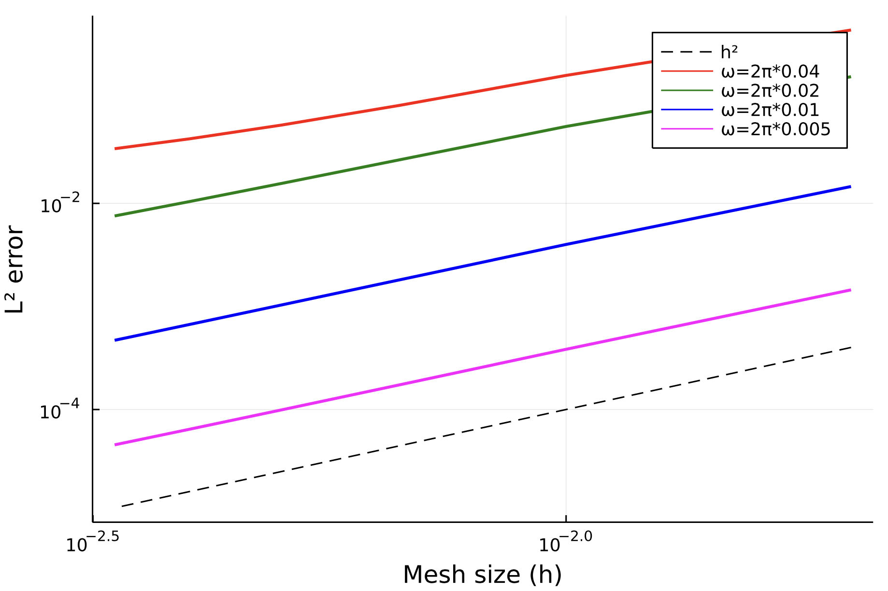

# iceFEM.jl

Contains the Julia package developed during Lift-Off Fellowship at
UoA. This package implements the coupled problem of wave-induced
motion of ice-shelves and icebergs.

## How to get it

To download the package, clone the repository, change directory and
start Julia using

```shell
git clone git@github.com:Balaje/iceFEM.jl.git
cd iceFEM.jl
julia --project=.
```

## Example 1

Solve the ice-shelf example under the shallow-water and finite depth
(potential flow) assumption. Set the ice-shelf and fluid properties:

```julia
using iceFEM

# Define the dimensional parameters of the ice and fluid
ρᵢ = 922.5; # Density of Ice
E = 2e9; ν = 0.33;
L = 40000; h = 200;
ρₒ = 1025; # Density of Ocean
xg = 0; k0 = 0; # Position of Grounding line and spring constant of bedrock (0 if not available)
H = 500; # Ocean Depth
g = 9.8; # Acceleration due to gravity
ice = Ice(ρᵢ, E, ν, L, h);
fluid = Fluid(ρₒ, k0, g, H, xg);
```

Now we solve the frequency domain problem

```julia
# Solve the frequency domain problem
ω = 2π/500;
Aₚ = g/(1im*ω);
sol1 = solve(ice, fluid, ω , FreeClamped(), FiniteDepth(4)); # Solve the finite depth problem using 4 modes
R1 = sol1.aₘ[1]/Aₚ;
sol2 = solve(ice, fluid, ω , FreeClamped(), ShallowWater()); # Solve the shallow water problem
R2 = sol2.a₀[1]/Aₚ;
Aₚ = g/(1im*ω);

# Show the reflection coeffcients
@show R1 abs(R1);
@show R2 abs(R2);
```
The `FreeClamped()` variable defines the type of boundary condition at
$x=0$ and $x=L$, respectively. Here $L$ is the length of the ice. For
example, `FreeClamped()` denotes an ice that is Free at $x=0$ and
Clamped at $x=L$. The ice can be
`FreeClamped()`, `FreeFree()`, `FreeHinged()` and
`FreeBedrock()`. Note for the `FreeBedrock()` case, correct (non-zero)
parameters must be specified in the for the fluid, for example:

``` julia
xg = 0.7*L; k0 = 10^6; # Position of Grounding line and spring constant of bedrock (0 if not available)
fluid = Fluid(ρₒ, k0, g, H, xg);
```

The fluid is governed by `ShallowWater()` assumption or the
`FiniteDepth(NModes)` assumption with `NModes` terms. Simply using
`FiniteDepth()` defaults to using 3 modes in the expansion.

The methods available for `solve` currently are as follows:

``` julia
solve(Ice::Ice, Fluid::Fluid, ω) # Defaults to ShallowWater() and FreeClamped()
solve(Ice::Ice, Fluid::Fluid, ω, ptype::Union{FreeClamped,FreeHinged}, ::ShallowWater)
solve(Ice::Ice, Fluid::Fluid, ω, fd::FiniteDepth) # Defaults to FreeClamped()
solve(Ice::Ice, Fluid::Fluid, ω, ptype::Union{FreeClamped,FreeHinged}, fd::FiniteDepth)
solve(Ice::Ice, Fluid::Fluid, ω, ::FreeBedrock, fd::FiniteDepth)
solve(ice::Ice, fluid::Fluid, ω, ::FreeFree, fd::FiniteDepth)
solve(ice::Ice, fluid::Fluid, ω, ptype, femodel::FiniteElementModel; verbosity)
solve(ice::Ice, fluid::Fluid, ω, ::FreeFree, fd::FiniteDepth, ::ReissnerMindlinIce; μ)
```

We can obtain the displacement profiles and plot them

``` julia
using Plots

x = 0:0.01:sol1.ndp.geo[1];

plt = plot(x, abs.(u₁(x, sol1)));
plot!(plt, x, abs.(u₁(x, sol2)));
```

Similarly we can obtain the slope/shear force/bending moment

``` julia
Slope = ∂ₓu₁(x, sol1);
BendingMoment = ∂ₓ²u₁(x, sol1);
ShearForce = ∂ₓ³u₁(x, sol1);
```

## Example 2

Same as in Example 1, but with moving bedrock. The bedrock is modelled
as a spring with spring constant $k_0$ that provides a vertical force on
the ice-shelf. Set the ice-shelf and fluid properties:

```julia
L = 10000
ρᵢ = 922.5
Eᵢ = 2e9
ν = 0.33
h = 200
ice = Ice(ρᵢ, Eᵢ, ν, L, h)

ρₒ = 1025.0
g = 9.8
H = 500
k₀ = 10^6
ϵ = 0.7
fluid = Fluid(ρₒ, k₀, g, H, ϵ*L) # The grounding line position is a fraction of the ice-length.
```

We then solve the coupled problem using (1) The finite-depth model (2)
The finite-element model and compare the results.

``` julia
ω = 2π/100
solFD = solve(ice, fluid, ω, FreeBedrock(), FiniteDepth(4));
```

For the finite element model, a mixed boundary condition
relating the displacement and slope (Dirichlet BCs) with the bending
moment and the shear force (Natural BCs) is implemented. The details
of the finite element model can be set using the `FiniteElementModel`
variable. 

``` julia
fe_model = FiniteElementModel(2, (100,20), 6, 4) # dim, partition, nev, NModes
solFE = solve(ice, fluid, ω, FreeBedrock(), fe_model)
```

To visualize the result, we use the function `u₁` for the ice above
the fluid and the function `u₂` for the ice above the bedrock.

``` julia
x₁ = 0:0.01:solFE.ndp.geo[4];
x₂ = solFE.ndp.geo[4]:0.01:solFE.ndp.geo[1];

# Compute the displacement of the ice
U₁FE = u₁(x₁, solFE); U₁FD = u₁(x₁, solFD);
U₂FE = u₂(x₂, solFE); U₂FD = u₂(x₂, solFD);

# Plot the results and label accordingly
p₁ = plot(x₁, abs.(U₁FE), label="FEM \$ (x < x_g) \$", linecolor=:red, linewidth=2);
plot!(p₁, x₁, abs.(U₁FD), label="EMM \$ (x < x_g) \$", linecolor=:blue, linewidth=2, linestyle=:dash);
plot!(p₁, x₂, abs.(U₂FE), label="FEM \$ (x > x_g) \$", linecolor=:green, linewidth=1);
plot!(p₁, x₂, abs.(U₂FD), label="EMM \$ (x > x_g) \$", linecolor=:black, linewidth=1, linestyle=:dash);
xlabel!(p₁, "x (non Dim)");
ylabel!(p₁, "\$ |u| \$ (in m)")
```

 |
---- |

We observe a good agreement between the finite depth solution and the
finite element solution. We also observe that the waves are attenuated
beyond the grounding line. A smaller value of $k_0$ makes the bedrock
less stiff, and we can observe the waves propagating throughout the ice
without damping.

## Example 3 - Order of convergence

In this example, we verify the rate of convergence of the finite element method based on modal expansion for the `FreeClamped` ice-shelf. We use modified expressions for the Euler-Bernoulli in-vacuo modes to get stable expressions for high frequencies. See this paper [here](https://www.sciencedirect.com/science/article/abs/pii/S0003682X18310685). We use the `FiniteDepth(4)` solution (eigenfunction matching with 4 modes) as the exact solution. The [full code](https://github.com/Balaje/iceFEM.jl/blob/master/examples/RateOfConvergence.jl) is given here in the `examples/` folder. We test this for 4 incident frequncies:

 |
---- |

For the test here, we choose our exact solution and approximate solution as:
```julia
# Exact Eigenfunction matching solution using 4 terms in the expansion.
solFD = iceFEM.solve(ice, fluid, ω, FreeClamped(), FiniteDepth(4)) 

# Finite element solution on a uniform domain with 40 in-vacuo modes for the ice and 8 modes for the ocean.
fe_model = FiniteElementModel(2, partition, 40, 8)
solFE = iceFEM.solve(ice, fluid, ω, FreeClamped(), fe_model; verbosity=0)
```

Since the default setting uses $P_1$ Lagrange finite element method, the rate of convergence is $\approx 2$. Note that the convergence also depends on the number of in-vacuo modes of the ice. Too few modes for the in-vacuo ice may erode the rate of convergence. However, sometimes fewer modes can be used to obtain a decent approximation. 

**NOTE:** The regularized expressions have been coded for the `FreeClamped()` beam only. Other beam types are not available yet and is WIP. 
